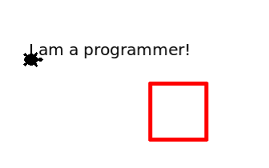
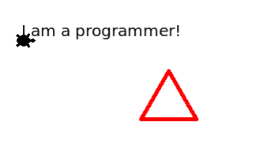

## Hrátky s želvičkou
### Cíl úkolu
- upravte kód tak, aby se výsledek programu co nejvíce podobal tomuto obrázku:
 
### Jak postupovat
- proveďte malou úpravu kódu (třeba změňte barvu)
- spusťe Run
- vidíte na výsledném obrázku požadovanou změnu?
- pokud ano, proveďte další malou změnu a opět spusťte Run
### Kód nefunguje? 
- spustili jste Run, ale žádný obrázek nevidíte
- vraťte se o krok zpět (CTRL + Z)
- opět spusťte Run
- pokud obrázek stále nevidíte, vytvořte novou kopii původního kódu:
https://replit.com/@LucieLenertova/Welcome-to-Python-and-Turtle
### Výzva
- pokud vám zbývá ještě čas, upravte obrázek takto:

### Výzva 2
- jaký další geometrický tvar zvládnete s želvičkou nakreslit?